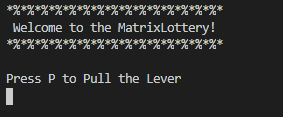
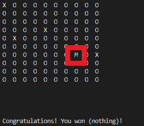
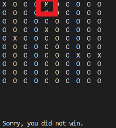

# Overview
MatrixLottery is a simple game involving pure, random luck. The user "pulls the lever," and then there is an animation of a cursor ("M") going across each character in the matrix. If your cursor lands on an X, you win. If it lands on an O, you do not win.

# Environment
* VSCode
* MinGW C++ compiler (see link below)

# Execution

 
 
 

# Useful Websites
* [MinGW C++ compiler](http://www.mingw.org/wiki/Install_MinGW)
* [C++ documentation](http://www.cplusplus.com/)
